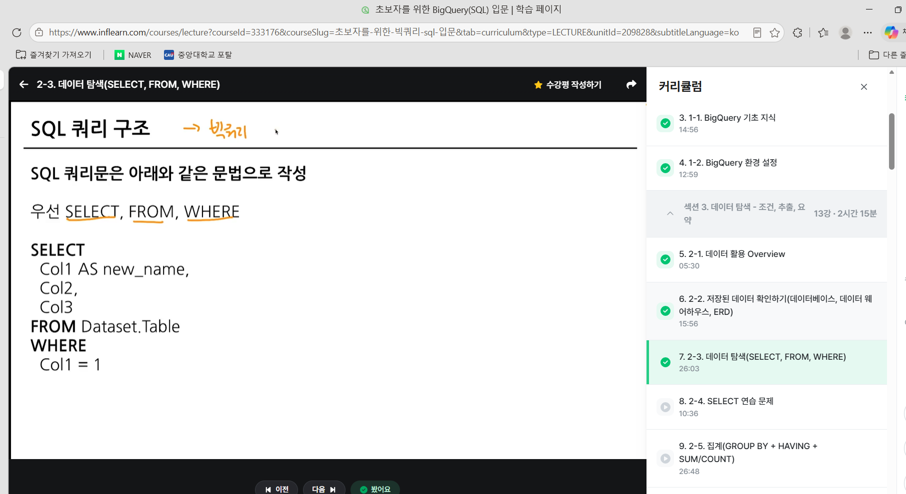
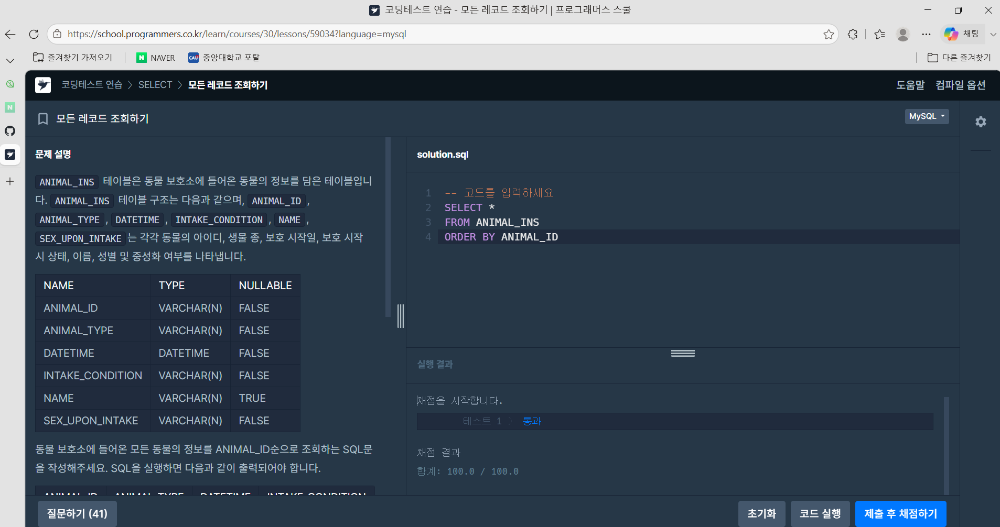
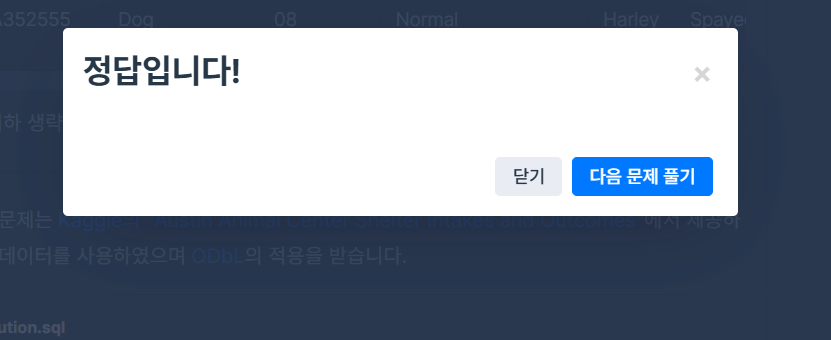
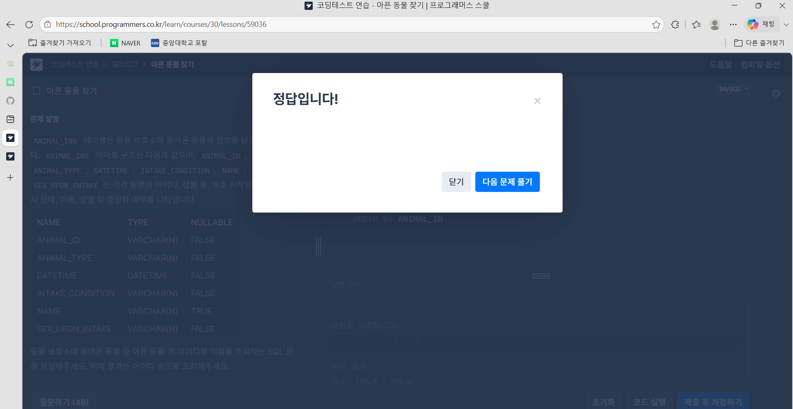

# 📘 SQL_BASIC 2주차 정규 과제

SQL_BASIC 정규 과제는 매주 정해진 분량의 `초보자를 위한 BigQuery(SQL) 입문` 강의를 듣고, 핵심 개념을 정리한 뒤 간단한 SQL 문제를 직접 풀어보는 방식으로 진행합니다.

이번 주는 저장된 데이터를 확인하는 방법과 `SELECT`, `FROM`, `WHERE`의 기본 구조를 학습합니다.

완성된 과제는 Github에 업로드하고, 링크를 스프레드시트 'SQL' 시트에 입력해 제출해주세요.

**👀 수행 인증란은 필수입니다.**

---

## 📚 SQL_BASIC_2nd_TIL

### 섹션 3. 데이터 탐색 - 조건, 추출, 요약

### 2-2. 저장된 데이터 확인하기(데이터베이스, 데이터 웨어하우스, ERD)

### 2-3. 데이터 탐색(SELECT, FROM, WHERE)

---

## ✨ 선택 강의

- 2-4. SELECT 연습 문제: SELECT, FROM, WHERE를 더 연습하고 싶을 때 선택 수강

---

## 🏁 전체 강의 수강 계획

| 주차 | 필수 강의 범위 | 선택 강의 | 완료 여부 |
| --- | --- | --- | --- |
| 1주차 | 1-1 ~ 2-1 | 1 | ✅ |
| 2주차 | 2-2 ~ 2-3 | 2-4 | ✅ |
| 3주차 | 2-5, 2-7 ~ 2-8 | 2-6 | 🍽️ |
| 4주차 | 3-2 ~ 4-3 | 3-4 | 🍽️ |
| 5주차 | 4-4 ~ 4-6 | 4-5, 4-7 | 🍽️ |
| 6주차 | 5-2 ~ 5-5 | 5-6 | 🍽️ |
| 7주차 | 필수 강의 없음 | 6-2, 6-3, 6-4, 6-5 | 🍽️ |

---

<br>

<!-- 여기까진 그대로 둬 주세요-->

---

# 1️⃣ 개념 정리

아래 키워드 중 중요하다고 생각한 개념을 2개 이상 골라 짧게 정리해주세요. 3개보다 더 많이 정리하고 싶다면 자유롭게 항목을 추가해도 좋습니다.

이번 주 키워드:
- SELECT
- FROM
- WHERE
- 조건식
- ORDER BY
- LIMIT
- 테이블 구조 확인

## 01. 

```
개념 이름: select
개념 설명: 
    Table에 저장되어 있는 컬럼 선택
    여러 컬럼 명시 가능
    col1 AS "별칭"으로 컬럼의 이름도 별칭 지정 가능

     
예시 쿼리:
 SELECT
    col 1 AS name,
    col 2 AS type,
    col 3 AS attack
```

## 02.

```
개념 이름: from
개념 설명: 
데이터를 확인할 Table 명시 (빅쿼리에서는 Dataset.table)
이름이 너무 길다면 AS " 별칭 " 으로 별칭 지정 가능
예시 쿼리: FROM Table A as t1
```

## (선택) 03.

```
개념 이름: Where
개념 설명:
From에 명시된 Table에 저장된 데이터를 필터링(조건 설정)
Table에 있는 컬럼을 조건 설정
예시: Where tyep1="Fire"
헷갈린 점:
쿼리 작성 시
    SELECT
    FROM
    WHERE <조건문>
순으로 써야 함.
```

---

# 2️⃣ 수행 인증란

아래 중 하나 이상을 첨부해주세요.

- 강의 수강 화면 캡처
- 문제 풀이 정답 화면 캡처
- SQL 실행 결과 화면 캡처

---

# 3️⃣ 확인 문제

프로그래머스는 로그인이 필요하므로, 로그인 후 문제 풀이를 진행해주세요.

## 🧩 문제 1

문제 링크: [모든 레코드 조회하기](https://school.programmers.co.kr/learn/courses/30/lessons/59034)

풀이 과정:

```
- 테이블에서 확인한 컬럼:
ANIMAL_ID(동물의 아이디) -VARCHAR(N)
ANIMAL_TYPE (생물 종) - VARCHAR(N)
DATETIME(보호 시작일)－DATETIME
INTAKE_CONDITION（보호 시작 시 상태）－VARCHAR(N)
NAME （이름）－VARCHAR(N)
SEX_UPON_INTAKE （성별 및 중성화 여부）－VARCHAR(N)
- SELECT와 FROM을 작성한 방식:From 뒤에 사용할 Table명 작성, 모든 컬럼을 추출하므로 select 뒤에 *작성
    SELECT *
    FROM ANIMAL_INS
    ORDER BY ANIMAL_ID
- 새로 배운 점:
```




## 🧩 문제 2

문제 링크: [아픈 동물 찾기](https://school.programmers.co.kr/learn/courses/30/lessons/59036)


풀이 과정:

```
- 문제에서 요구한 조건: 동물 보호소에 들어온 동물 중 아픈 동물1의 아이디와 이름을 조회하는 SQL 문을 작성, 결과는 아이디 순으로 조회
- WHERE 절로 옮긴 방식:
SELECT
    ANIMAL_ID,
    NAME
FROM ANIMAL_INS
WHERE INTAKE_CONDITION= "SICK"
ORDER BY ANIMAL_ID
- 정렬 기준이 있다면 사용한 기준: ANIMAL_ID 기준 오름차순(기본값) 정렬함.
- 새로 배운 점: WHERE 절을 통해 내가 원하는 특정행들만 조회할 수 있음.
```



---

# 4️⃣ 이번 주 회고

```
1. SELECT, FROM, WHERE 중 가장 헷갈린 개념: 
쿼리를 작성할 때는 
    SELECT
    FROM
    WHERE
순으로 작성되지만 실제 시스템 내 실행 순서는
    FROM
    WHERE
    SELECT
순이라는 점이 가장 헷갈렸습니다.

2. 문제를 풀 때 가장 자주 확인하게 된 부분:
문제 풀 때 어떤 조건절 WHERE을 써야하는지 가장 중요하게 생각한것 같습니다.

3. 다음 주 문제 풀이에서 의식하고 싶은 습관: 
TABLE과 SELECT문에서 이름이 너무 길 경우, TABLE별칭과 컬럼 별칭을 사용할 것 입니다. (AS 사용)
컬럼 별칭 지정시 AS " " 식으로 AS 뒤에 따옴표가 올 수 없다는 점을 유의할 것입니다.

```

수고하셨습니다!


