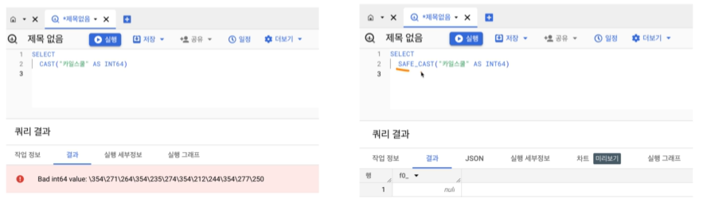
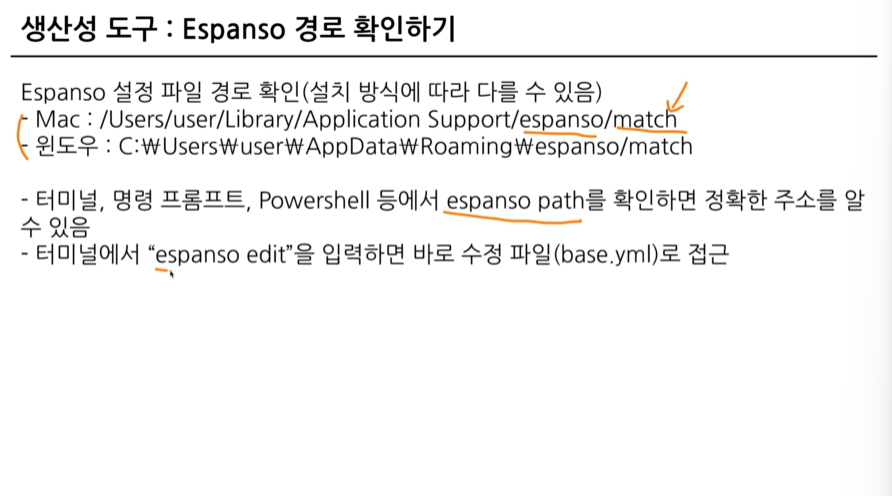
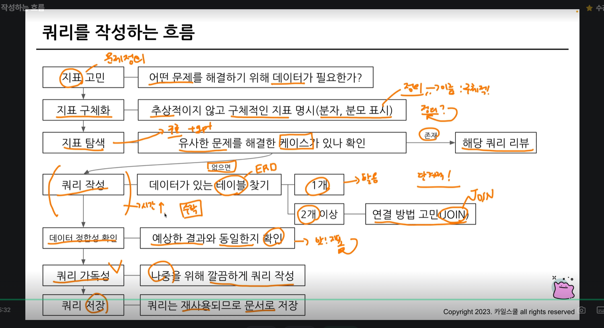
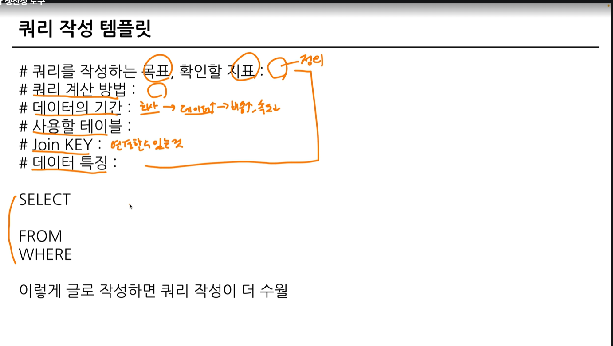
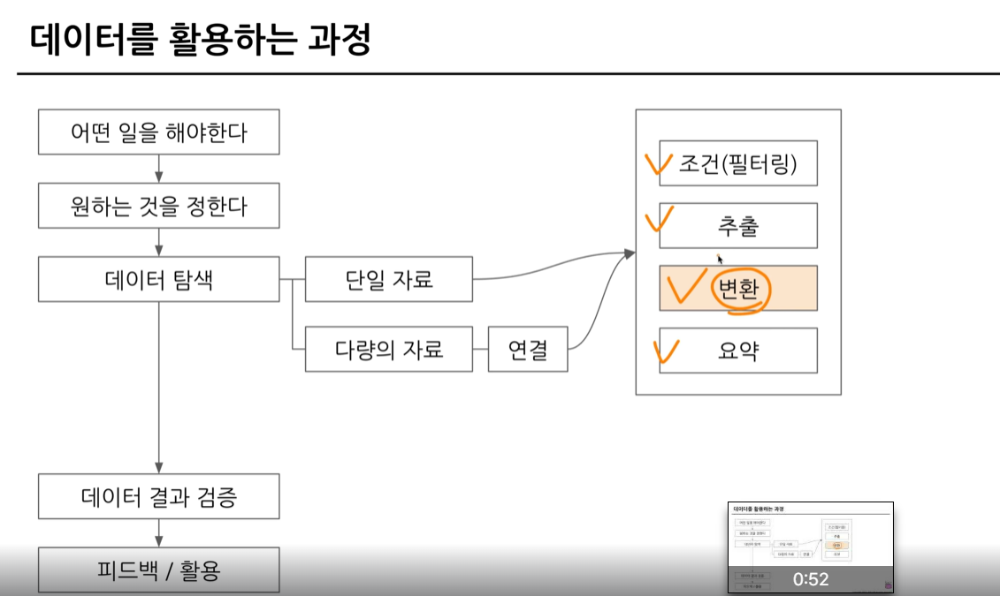
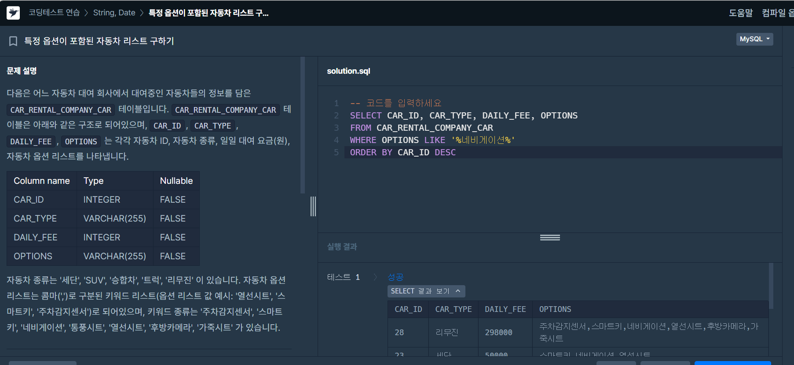
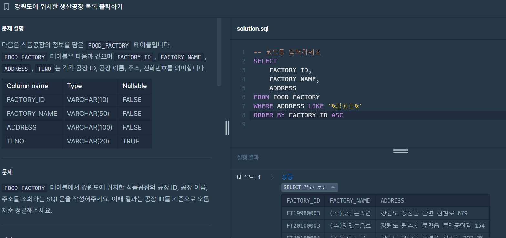
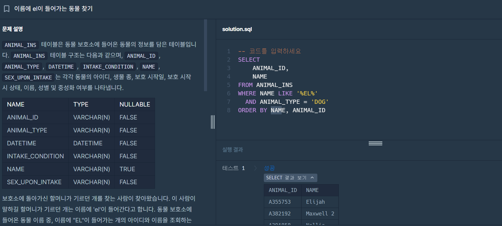
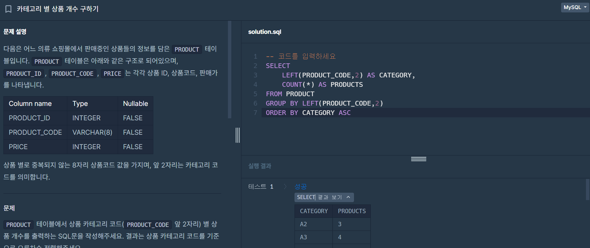

# 📘 SQL_BASIC 4주차 정규 과제

SQL_BASIC 정규 과제는 매주 정해진 분량의 `초보자를 위한 BigQuery(SQL) 입문` 강의를 듣고, 핵심 개념을 정리한 뒤 간단한 SQL 문제를 직접 풀어보는 방식으로 진행합니다.

이번 주는 SQL 쿼리를 작성하는 흐름, 쿼리 작성 템플릿, 데이터 타입 변환, 문자열 함수를 학습합니다.

완성된 과제는 Github에 업로드하고, 링크를 스프레드시트 'SQL' 시트에 입력해 제출해주세요.

**👀 수행 인증란은 필수입니다.**

---

## 📚 SQL_BASIC_4th_TIL

### 섹션 4. SQL 쿼리 잘 작성하기, 쿼리 작성 템플릿 및 오류를 잘 디버깅하기

### 3-2. SQL 쿼리를 작성하는 흐름

### 3-3. 쿼리 작성 템플릿과 생산성 도구

### 섹션 5. 데이터 탐색 - 변환

### 4-1. INTRO

### 4-2. 데이터 타입과 데이터 변환(CAST, SAFE_CAST)

### 4-3. 문자열 함수(CONCAT, SPLIT, REPLACE, TRIM, UPPER)

---

## ✨ 선택 강의

- 3-4. 오류를 디버깅하는 방법: 오류 메시지 해석과 디버깅 흐름을 더 익히고 싶을 때 선택 수강

---

## 🏁 전체 강의 수강 계획

| 주차 | 필수 강의 범위 | 선택 강의 | 완료 여부 |
| --- | --- | --- | --- |
| 1주차 | 1-1 ~ 2-1 | 1 | ✅ |
| 2주차 | 2-2 ~ 2-3 | 2-4 | ✅ |
| 3주차 | 2-5, 2-7 ~ 2-8 | 2-6 | ✅ |
| 4주차 | 3-2 ~ 4-3 | 3-4 | ✅ |
| 5주차 | 4-4 ~ 4-6 | 4-5, 4-7 | 🍽️ |
| 6주차 | 5-2 ~ 5-5 | 5-6 | 🍽️ |
| 7주차 | 필수 강의 없음 | 6-2, 6-3, 6-4, 6-5 | 🍽️ |

---

<br>

<!-- 여기까진 그대로 둬 주세요-->

---

# 1️⃣ 개념 정리

아래 키워드 중 중요하다고 생각한 개념을 2개 이상 골라 짧게 정리해주세요. 3개보다 더 많이 정리하고 싶다면 자유롭게 항목을 추가해도 좋습니다.

이번 주 키워드:
- 쿼리 작성 순서
- 쿼리 작성 템플릿
- 데이터 타입
- CAST
- SAFE_CAST
- CONCAT
- REPLACE
- TRIM


## 01.

```
개념 이름: 데이터 타입
개념 설명:
## 데이터 타입
-숫자(정수, 소수) EX) 1,2,3.14
-문자 EX) "나", "데이터"
-시간, 날짜
-부울(Bool): 참, 거짓 
-JSON, ARRAY 등등
예시 쿼리:
SELECT
컬럼1
컬럼2
컬럼3
FROM table
WHERE 조건 = TRUE(FALSE)
```

## 02.

```
개념 이름: CAST
개념 설명: 자료 타입을 변경하는 함수
예시 쿼리:
SELECT
 CAST(1 AS STRING) : 숫자 1을 문자 1로 변경

SELECT
 CAST("카일스쿨"AS INT64) --> 오류

**추가 개념
더 안전하게 데이터 타입 변경하기 - SAFE_CAST

SAFE_가 붙은 함수는 변환이 실패할 경우 NULL반환 
EX) SAFE_DIVIDE(x,y) --> X,Y 중 하나라도 0 인 경우 그냥 나누면 ZERO ERROR 발생
```

## (선택) 03.

```
개념 이름: CONCAT
개념 설명: 문자열 붙이기
예시 쿼리:
SELECT
 CONCAT("안녕","하세요","!") AS result
헷갈린 점: 
FROM이 없는데 어떻게 동작할까?
CONCAT 인자로 STRING이나 숫자를 넣을 때는 데이터를 직접 넣어준 것이므로 FROM이 없어도 실행된다.
*결과: 안녕하세요!

개념 이름: SPLIT
개념 설명: 문자열 나누기
예시 쿼리:
SELECT
 SPLIT("가, 나, 다, 라",",") AS result
 SPLIT(문자열 원본, 나눌 기준이 되는 문자)
 *결과: "가" , " 나" , " 다" , " 라" (배열)

개념 이름: REPLACE
개념 설명: 문자열 대체하기
예시 쿼리:
SELECT
 REPLACE("안녕하세요","안녕","실천") AS result
 REPLACE(문자열 원본, 찾을 단어, 바꿀 단어)

개념 이름: TRIM
개념 설명: 문자열 자르기
예시 쿼리:
SELECT
 TRIM("안녕하세요","하세요") AS result
 TRIM(문자열 원본, 자를 단어)

개념 이름: UPPER
개념 설명: 대문자로 변경
예시 쿼리:
SELECT
 UPPER("abc") AS result
 UPPER(문자열 원본)
```
생산성 도구 : ESPANSO 
특정단어를 입력하면 원하는 문장(템플릿)으로 변경

---

# 2️⃣ 수행 인증란





---

# 3️⃣ 확인 문제

프로그래머스는 로그인이 필요하므로, 로그인 후 문제 풀이를 진행해주세요.

## 🧩 문제 1

문제 링크: [특정 옵션이 포함된 자동차 리스트 구하기](https://school.programmers.co.kr/learn/courses/30/lessons/157343)

풀이 과정:

```
- 찾으려는 문자열 조건: 
CAR_RENTAL_COMPANY_CAR 테이블에서 '네비게이션' 옵션이 포함된 자동차 리스트를 출력하는 SQL문을 작성, 결과는 자동차 ID를 기준으로 내림차순 정렬
'네비게이션'옵션이 포함된 자동차 찾기:
WHERE OPTIONS LIKE '%네비게이션%'
- 사용한 문자열 조건 문법:
- 정렬 기준:자동차 ID기준 내림차순 정렬
ORDER BY CAR_ID DESC
최종 쿼리문: 
SELECT CAR_ID, CAR_TYPE, DAILY_FEE, OPTIONS
FROM CAR_RENTAL_COMPANY_CAR
WHERE OPTIONS LIKE '%네비게이션%'
ORDER BY CAR_ID DESC
```



## 🧩 문제 2

문제 링크: [강원도에 위치한 생산공장 목록 출력하기](https://school.programmers.co.kr/learn/courses/30/lessons/131112)

풀이 과정:

```
- 문제에서 요구한 조건:
FOOD_FACTORY 테이블에서 강원도에 위치한 식품공장의 공장 ID, 공장 이름, 주소를 조회하는 SQL문을 작성,결과는 공장 ID를 기준으로 오름차순 정렬
- WHERE 절로 옮긴 방식:
WHERE ADDRESS LIKE '%강원도%'
- 정렬 기준:공장 ID기준 오름차순 
ORDER BY FACTORY_ID ASC
```



## 🧩 문제 3

문제 링크: [이름에 el이 들어가는 동물 찾기](https://school.programmers.co.kr/learn/courses/30/lessons/59047)

풀이 과정:

```
- 찾으려는 문자열 패턴: 
동물 보호소에 들어온 동물 이름 중, 이름에 "EL"이 들어가는 개의 아이디와 이름을 조회
WHERE NAME LIKE '%EL%'
  AND ANIMAL_TYPE = 'DOG'

- 대소문자를 처리한 방식: 
MySQL의 기본 문자열 비교가 대소문자를 구분하지 않는 설정

- 정렬 기준: 
결과는 이름 순으로 조회, 이름이 같은 경우 아이디를 기준으로 조회
ORDER BY NAME, ANIMAL_ID
```



## 🧩 문제 4

문제 링크: [카테고리 별 상품 개수 구하기](https://school.programmers.co.kr/learn/courses/30/lessons/131529)

풀이 과정:

```
- 추출한 문자열 범위:
PRODUCT 테이블에서 상품 카테고리 코드(PRODUCT_CODE 앞 2자리 추출)
LEFT(PRODUCT_CODE,2)
- 그룹화 기준:
상품 카테고리 코드(PRODUCT_CODE 앞 2자리) 별 상품 개수를 출력
GROUP BY LEFT(PRODUCT_CODE,2)
- 정렬 기준:
상품 카테고리 코드를 기준으로 오름차순 정렬
ORDER BY CATEGORY ASC
- 전체 쿼리:
SELECT 
    LEFT(PRODUCT_CODE,2) AS CATEGORY,
    COUNT(*) AS PRODUCTS
FROM PRODUCT
GROUP BY LEFT(PRODUCT_CODE,2)
ORDER BY CATEGORY ASC 

```



---

# 4️⃣ 이번 주 회고

```
1. 쿼리 작성 흐름을 잡을 때 도움이 된 방법:
쿼리 작성 템플릿을 ESPANSO라는 생산성 도구를 사용하여 정형화할 수 있어서 좋았다.
문제에서 요구하는 조회 컬럼, 조건, 정렬 기준을 먼저 정리한 뒤 작성하니 쿼리 구조를 잡기가 더 쉬웠다.

2. 타입 변환이나 문자열 처리에서 조심해야 할 점:
'보이는 것'과 '저장된 것'이 다를 수 있으므로 데이터 타입을 먼저 파악하는 것이 중요하다.
CAST를 사용할 때는 변환 가능한 값인지 확인해야 하며, 문자열 처리에서는 공백이나 대소문자 , 포함 여부를 주의해서 조건을 작성해야 한다.

3. 앞으로 문제 풀이 때 먼저 확인할 것:
문제에서 요구하는 조건, 데이터 타입, 정렬 기준을 먼저 확인하고 쿼리를 작성할 것이다.
```

수고하셨습니다!


