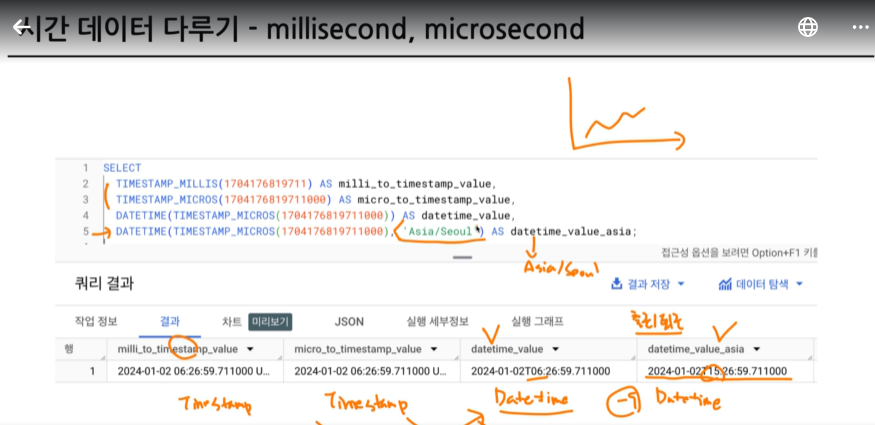
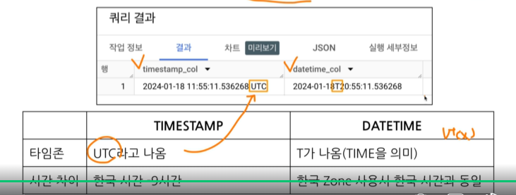
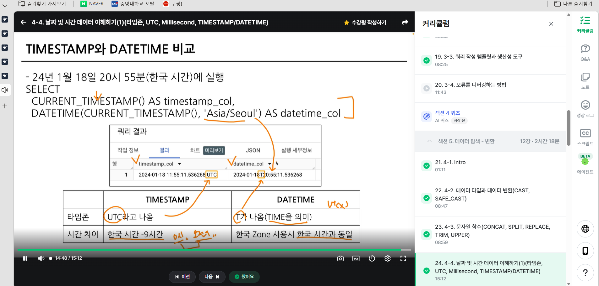
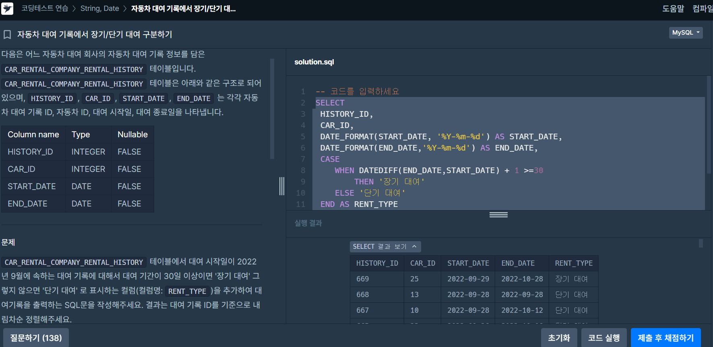
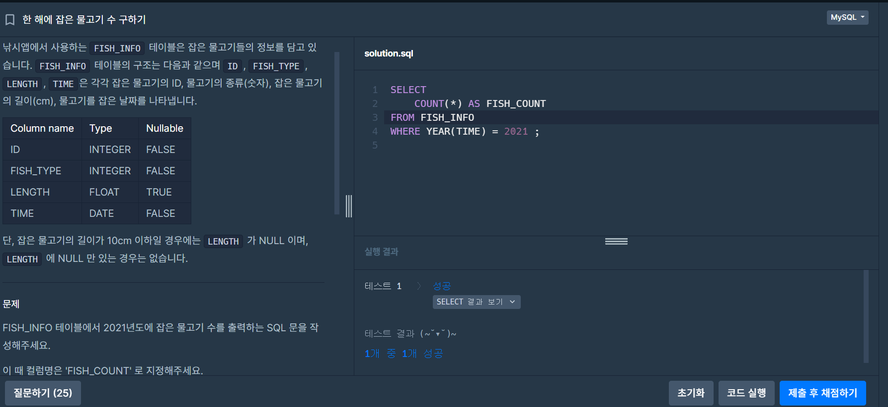
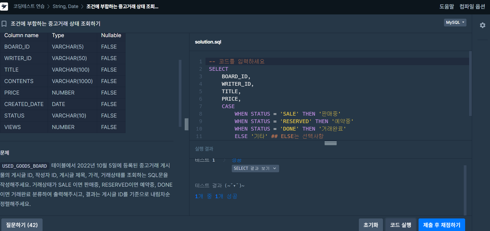
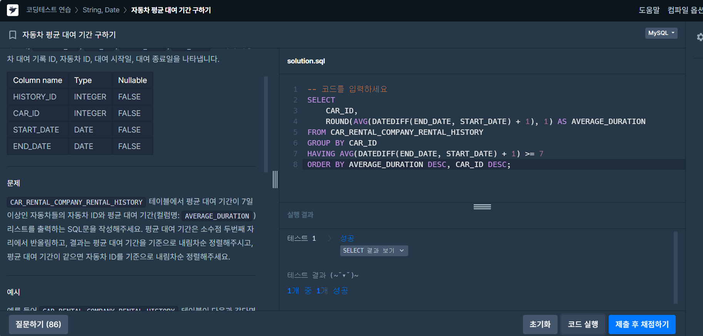

# 📘 SQL_BASIC 5주차 정규 과제

SQL_BASIC 정규 과제는 매주 정해진 분량의 `초보자를 위한 BigQuery(SQL) 입문` 강의를 듣고, 핵심 개념을 정리한 뒤 간단한 SQL 문제를 직접 풀어보는 방식으로 진행합니다.

이번 주는 날짜/시간 데이터와 조건문을 학습합니다. 특히 `CASE WHEN`은 SQL 문제 풀이와 데이터 분석에서 자주 사용되므로, 직접 분류 기준을 만들고 결과를 확인하는 연습을 해주세요.

완성된 과제는 Github에 업로드하고, 링크를 스프레드시트 'SQL' 시트에 입력해 제출해주세요.

**👀 수행 인증란은 필수입니다.**

---

## 📚 SQL_BASIC_5th_TIL

### 섹션 5. 데이터 탐색 - 변환

### 4-4. 날짜 및 시간 데이터 이해하기

### 4-6. 조건문(CASE WHEN, IF)

---

## ✨ 선택 강의

- 4-5. 시간 데이터 연습문제: 날짜/시간 함수를 더 연습하고 싶을 때 선택 수강
- 4-7. 조건문 연습문제: CASE WHEN과 IF를 더 연습하고 싶을 때 선택 수강

---

## 🏁 전체 강의 수강 계획

| 주차 | 필수 강의 범위 | 선택 강의 | 완료 여부 |
| --- | --- | --- | --- |
| 1주차 | 1-1 ~ 2-1 | 1 | ✅ |
| 2주차 | 2-2 ~ 2-3 | 2-4 | ✅ |
| 3주차 | 2-5, 2-7 ~ 2-8 | 2-6 | ✅ |
| 4주차 | 3-2 ~ 4-3 | 3-4 | ✅ |
| 5주차 | 4-4 ~ 4-6 | 4-5, 4-7 | ✅ |
| 6주차 | 5-2 ~ 5-5 | 5-6 | 🍽️ |
| 7주차 | 필수 강의 없음 | 6-2, 6-3, 6-4, 6-5 | 🍽️ |

---

<br>

<!-- 여기까진 그대로 둬 주세요-->

---

# 1️⃣ 개념 정리

아래 키워드 중 중요하다고 생각한 개념을 2개 이상 골라 짧게 정리해주세요. 3개보다 더 많이 정리하고 싶다면 자유롭게 항목을 추가해도 좋습니다.

이번 주 키워드:
- DATE
- DATETIME
- TIMESTAMP
- EXTRACT
- DATETIME_TRUNC
- FORMAT_DATETIME
- CASE WHEN
- IF

## 01.

```
개념 이름: DATE
개념 설명: Date만 표시하는 데이터
예시 쿼리: 2023-12-31

개념 이름: TIME
개념 설명: Time만 표시하는 데이터
예시 쿼리: 23:59:59.00

개념 이름: DATETIME
개념 설명: DATE와 TIME까지 표시하는 데이터
예시 쿼리: 2023-12-31 14:00:00
```

## 02.

```
개념 이름:타임존 (시간 데이터)
개념 설명: 
GMT: Greenwich Mean Time (한국시간 : GMT +9)
-영국의 그리니치 천문대 (경도0도)를 기준으로 지역에 따른 시간의 차이를 조정하기 위해 생긴 시간의 구분선 (1884년 채택)
-영국 근처에서 자주 활용

UTC: Universal Time Coordinated (한국시간: UTC +9)
-국제적인 표준 시간
-협정 세계시
-타임존이 존재한다 = 특정 지역의 표준 시간대

TIMESTAMP
-시간도장
-UTC부터 경과한 시간을 나타내는 값
-TIME ZONE 정보 있음
-2023-12-31 14:00:00 UTC

millisecond(ms)
-시간의 단위, 천분의 1초(1,000ms=1초)
-빠른 반응이 필요한 분야에서 사용

microsecond(Ms)
-1/1000ms,1/1,000,000초



Millisecond/ Microsecond -> Timestamp -> Datetime

예시 쿼리: 
SELECT
 TIMESTAMP_MILLIS(1704176819711)
 TIMESTAMP_MICORS(1704176819711000)
 DATETIME(TIMESTAMP_MILLIS(1704176819711)) AS date_time value # 오류
 DATETIME(TIMESTAMP_MILLIS(1704176819711),'Asia/Seoul') AS date_time value_asia # 정상 ;

 TIMESTAMP<->DATETIME 변환
 (보통 TIMESTAMP를 DATETIME으로 변경)
SELECT
 CURRENT_TIMESTAMP() AS timestamp_col
 DATETIME(CURRENT_TIMESTAMP(),'ASIA/SEOUL') AS datetime_col

TIMESTAMP - UTC라고 나옴, 한국시간-9시간
DATETIME - T가 나옴, 한국 ZONE사용 시 한국 시간과 동일
```

## (선택) 03.

```
개념 이름:
개념 설명:
헷갈린 점:
```

---

# 2️⃣ 수행 인증란

아래 중 하나 이상을 첨부해주세요.

- 강의 수강 화면 캡처
- 문제 풀이 정답 화면 캡처
- SQL 실행 결과 화면 캡처


---

# 3️⃣ 확인 문제

프로그래머스는 로그인이 필요하므로, 로그인 후 문제 풀이를 진행해주세요.

## 🧩 문제 1

문제 링크: [자동차 대여 기록에서 장기/단기 대여 구분하기](https://school.programmers.co.kr/learn/courses/30/lessons/151138)

풀이 과정:

```
- 장기/단기 대여를 나눈 기준:
대여 기간이 30일 이상이면 '장기 대여' 그렇지 않으면 '단기 대여' 

- 사용한 날짜 계산 방식: 
날짜 간격을 계산하는 DATEDIFF(END_DATE, START_DATE) 함수를 사용
하지만 여기서 대여 일수는 날짜간격에서 하루를 추가해야 하므로 1을 더함.

- CASE WHEN으로 만든 컬럼: RENT_TYPE
CASE
    WHEN DATEDIFF(END_DATE,START_DATE) + 1 >=30
        THEN '장기 대여'
    ELSE '단기 대여'
 END AS RENT_TYPE

 -전체 쿼리문:
 SELECT 
 HISTORY_ID,
 CAR_ID,
 DATE_FORMAT(START_DATE, '%Y-%m-%d') AS START_DATE,
 DATE_FORMAT(END_DATE,'%Y-%m-%d') AS END_DATE,
 CASE
    WHEN DATEDIFF(END_DATE,START_DATE) + 1 >=30
        THEN '장기 대여'
    ELSE '단기 대여'
 END AS RENT_TYPE
FROM CAR_RENTAL_COMPANY_RENTAL_HISTORY
WHERE START_DATE >= '2022-09-01'
    AND START_DATE <'2022-10-01'
ORDER BY HISTORY_ID DESC
```



## 🧩 문제 2

문제 링크: [한 해에 잡은 물고기 수 구하기](https://school.programmers.co.kr/learn/courses/30/lessons/298516)

풀이 과정:

```
- 문제에서 요구한 연도: 2021년

- 사용한 날짜 조건: WHERE YEAR(TIME) = 2021 
*YEAR은 시간에서 연도만 추출하는 함수

- 집계한 대상: 2021년도에 잡힌 물고기 기록의 개수
  * COUNT(*)는 조건에 해당하는 행의 개수를 세는 함수

- 컬럼명 지정: AS FISH_COUNT

- 전체 쿼리문: 
SELECT
    COUNT(*) AS FISH_COUNT    
FROM FISH_INFO
WHERE YEAR(TIME) = 2021 ;
```



## 🧩 문제 3

문제 링크: [조건에 부합하는 중고거래 상태 조회하기](https://school.programmers.co.kr/learn/courses/30/lessons/164672)

풀이 과정:

```
- 날짜 조건:
 2022년 10월 5일에 등록된 중고거래 게시물
 WHERE CREATED_DATE = '2022-10-05'

- CASE WHEN으로 바꾼 값: 
 거래상태가 SALE 이면 판매중, RESERVED이면 예약중, DONE이면 거래완료 분류하여 출력

- ELSE에 해당하는 경우:
앞의 모든 WHEN 조건에 해당하지 않는 나머지 경우
: 거래 상태가 SALE, RESERVED, DONE 중 그 어디에도 속하지 않는 경우

- 정렬 기준: 
 게시글 ID를 기준으로 내림차순 정렬
 ORDER BY BOARD_ID DESC

- 전체 쿼리문:
SELECT
    BOARD_ID,
    WRITER_ID,
    TITLE,
    PRICE,
    CASE
        WHEN STATUS = 'SALE' THEN '판매중'
        WHEN STATUS = 'RESERVED' THEN '예약중'
        WHEN STATUS = 'DONE' THEN '거래완료'
        ELSE '기타' ## ELSE는 선택사항
    END AS STATUS
FROM USED_GOODS_BOARD
WHERE CREATED_DATE = '2022-10-05'
ORDER BY BOARD_ID DESC
```



## 🧩 문제 4

문제 링크: [자동차 평균 대여 기간 구하기](https://school.programmers.co.kr/learn/courses/30/lessons/157342)

풀이 과정:

```
- GROUP BY 기준:CAR_ID
→ 자동차별로 대여 기록을 묶어서 평균 대여 기간을 계산

- 평균을 계산한 방식:AVG(DATEDIFF(END_DATE, START_DATE) + 1)
→ 각 대여 기록의 기간을 구한 뒤 자동차별 평균 계산

- HAVING에 사용한 조건: 평균 대여 기간 >= 7
→ HAVING AVG(DATEDIFF(END_DATE, START_DATE) + 1) >= 7

- 처음 헷갈렸던 점: WHERE와 HAVING의 차이
→ 평균값처럼 GROUP BY 이후 계산되는 집계 결과에 조건을 걸 때는 WHERE가 아니라 HAVING을 사용해야 함.
```


---

# 4️⃣ 이번 주 회고

```
1. 날짜 함수 중 가장 헷갈린 함수:
DATEDIFF()
→ 두 날짜 사이의 차이를 계산하는 함수인데, 실제 대여 기간처럼 시작일과 종료일을 모두 포함하려면 +1을 해줘야 한다는 점이 헷갈렸음.

2. CASE WHEN을 사용할 때 기억해야 할 문법:
→ CASE WHEN 조건 THEN 결과 ELSE 결과 END 형태로 작성하고, ELSE는 생략할 수 있지만 어떤 조건에도 해당하지 않으면 NULL이 반환된다는 점을 기억해야 함.

3. 날짜/시간 데이터나 조건문을 활용해보고 싶은 분석 상황:
→ 고객의 이용 기간이나 최근 이용 시점을 기준으로 장기 고객/단기 고객을 나누거나, 구매 날짜를 기준으로 월별·계절별 소비 패턴을 분석해보고 싶음.
```

수고하셨습니다!


